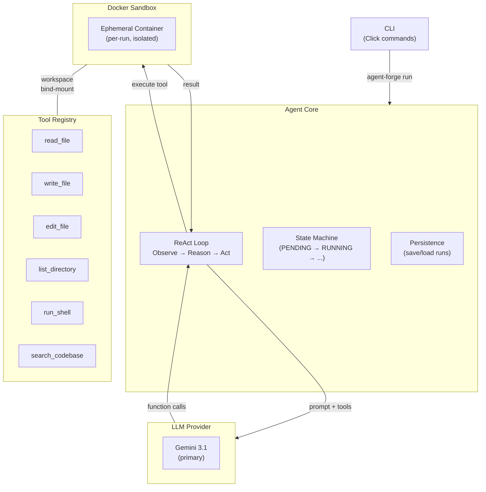
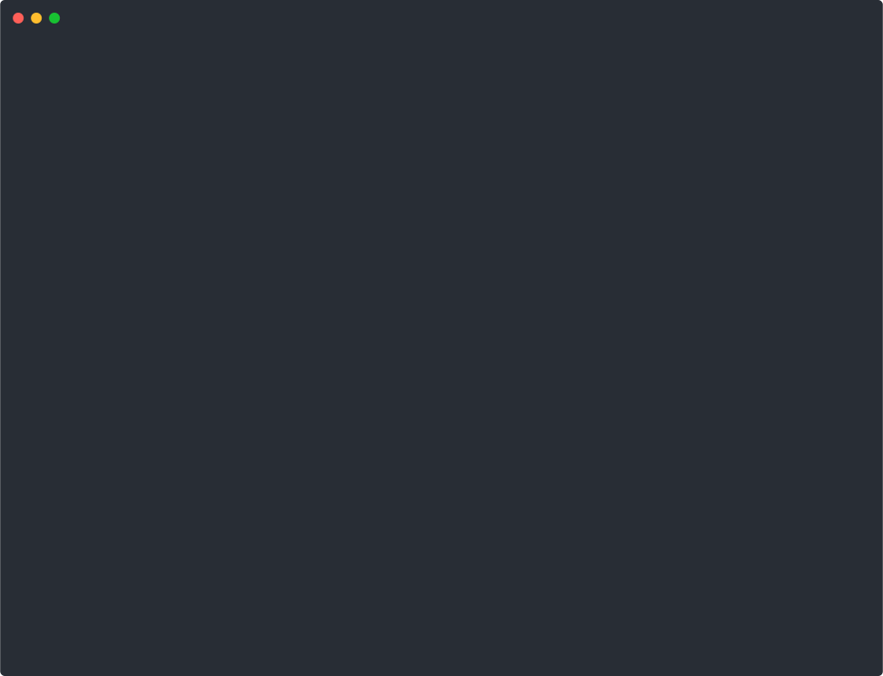

# Agent Forge

> A sandboxed AI coding agent runtime that autonomously modifies codebases through LLM-driven reasoning and isolated tool execution.

[](https://github.com/akoita/agent-forge/actions/workflows/ci.yml)
[](https://github.com/akoita/agent-forge/actions/workflows/e2e-tests.yml)
[](LICENSE)
[](https://www.python.org/downloads/)
[](https://github.com/astral-sh/ruff)

---

## Overview

Agent Forge implements the **ReAct** (Reasoning + Acting) pattern: an agent receives a coding task, iteratively reasons about what to do via an LLM, invokes tools inside **ephemeral Docker containers**, and loops until the task is complete.



### Key Features

- **🔒 Sandboxed Execution** — Every tool invocation runs in an ephemeral Docker container with resource limits — never on the host.
- **🧠 Gemini 3.1 Ready** — Full support for thought signatures, exponential backoff with jitter, and `Retry-After` header.
- **🔌 Extensible LLM Layer** — Gemini adapter built, OpenAI and Anthropic interfaces defined for easy addition.
- **📊 Observability** — Structured JSON logs, trace IDs, token/cost tracking on every run.
- **💾 Run Persistence** — Every agent run is saved to disk with full conversation history and tool invocations.
- **🧩 Extensible Tools** — Add new tools by implementing a simple `Tool` ABC and registering them.

---

## Quick Start

> ✅ _Verified end-to-end with `gemini-3.1-flash-lite-preview` on 2026-03-07 — 17/17 E2E tests passing._

### Prerequisites

- Python 3.11+
- Docker
- A Gemini API key (or OpenAI/Anthropic)

### Installation

```bash
# Clone the repository
git clone https://github.com/akoita/agent-forge.git
cd agent-forge

# Install in development mode
pip install -e ".[dev]"

# Build the sandbox Docker image
make build-sandbox

# Set your API key
export GEMINI_API_KEY="your-key-here"
```

### Usage

```bash
# Run an agent task (direct mode — default)
agent-forge run \
  --task "Add input validation to the /api/users endpoint" \
  --repo ./path/to/your/repo

# Run via queue → worker pipeline (in-memory)
agent-forge run \
  --task "Fix login bug" \
  --repo ./my-app \
  --queue memory

# Run via Redis queue (requires Redis)
agent-forge run \
  --task "Refactor auth module" \
  --repo ./my-app \
  --queue redis \
  --redis-url redis://localhost:6379/0 \
  --max-concurrent-runs 4

# Check run status
agent-forge status <run-id>

# List recent runs
agent-forge list

# View resolved configuration
agent-forge config

# Run the hosted service
agent-forge serve --host 127.0.0.1 --port 8000
```

### Demo

<p align="center">
  
</p>

<details>
<summary>Run the demo locally</summary>

```bash
# Watch the simulated demo
bash scripts/demo.sh

# Record a new asciinema cast
bash scripts/record-demo.sh
```

</details>

---

## Configuration

Agent Forge uses a layered configuration system (CLI flags > env vars > project config > user config > defaults).

Create an `agent-forge.toml` in your project root:

```toml
[agent]
max_iterations = 25
default_provider = "gemini"
default_model = "gemini-3.1-flash-lite-preview"

[sandbox]
memory_limit = "512m"
timeout_seconds = 300
network_enabled = false
```

See the [Configuration Guide](docs/configuration.md) for full reference.
For hosted deployments, auth, and operations, see the
[Hosted Service Guide](docs/hosted-service.md).

---

## Development

```bash
# Install dev dependencies
pip install -e ".[dev,redis]"

# Run unit tests
make test-unit

# Run all tests (requires Docker)
make test

# Run e2e tests (requires GEMINI_API_KEY + Docker)
make test-e2e

# Lint & format
make lint
make format
```

### Project Structure

```
agent_forge/
├── agent/         # ReAct loop, state machine, prompts, persistence
├── llm/           # LLM provider adapters (Gemini, OpenAI, Anthropic)
├── tools/         # Built-in tools (read_file, write_file, run_shell, etc.)
├── sandbox/       # Docker sandbox management
├── orchestration/ # Task queue, event bus, workers
├── observability/ # Structured logging, tracing, cost tracking
├── cli.py         # Click-based CLI entry point
└── config.py      # Layered configuration system
```

---

## Documentation

- **[Architecture](docs/architecture.md)** — System design, layer responsibilities, ReAct loop sequence.
- **[Configuration](docs/configuration.md)** — Full config reference (TOML, env vars, CLI flags, precedence).
- **[Hosted Service](docs/hosted-service.md)** — Hosted architecture, trust boundaries, local-dev, and operations.
- **[Testing](docs/testing.md)** — Running tests, writing new ones, CI workflows, coverage.
- **[Extending](docs/extending.md)** — Adding tools, LLM providers, custom sandbox configs.
- **[Technical Spec](docs/spec.md)** — Full specification with interface contracts and data models.

---

## Roadmap

| Phase | Focus                                                             | Status         |
| ----- | ----------------------------------------------------------------- | -------------- |
| **1** | Core Agent MVP — ReAct loop + Docker sandbox + CLI                | ✅ Complete    |
| **2** | Production Hardening — Observability, multi-provider, Redis queue | 🚧 In Progress |
| **3** | Git-Aware Agent & Plugin System                                   | ⬜ Planned     |
| **4** | Web Dashboard & REST API                                          | ⬜ Planned     |
| **5** | Multi-Agent Collaboration                                         | ⬜ Planned     |
| **6** | Advanced Isolation & Scaling (microVMs, K8s)                      | ⬜ Planned     |
| **7** | Platform & Ecosystem (MCP, marketplace, IDE plugins)              | ⬜ Planned     |

See [spec.md § Roadmap](docs/spec.md#12-roadmap) for detailed milestones.

---

## Contributing

Contributions are welcome! Please read our [Contributing Guide](CONTRIBUTING.md) and [Code of Conduct](CODE_OF_CONDUCT.md) before submitting a pull request.

---

## Security

If you discover a security vulnerability, please follow our [Security Policy](SECURITY.md) for responsible disclosure.

---

## License

This project is licensed under the MIT License — see the [LICENSE](LICENSE) file for details.
