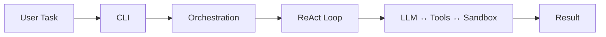
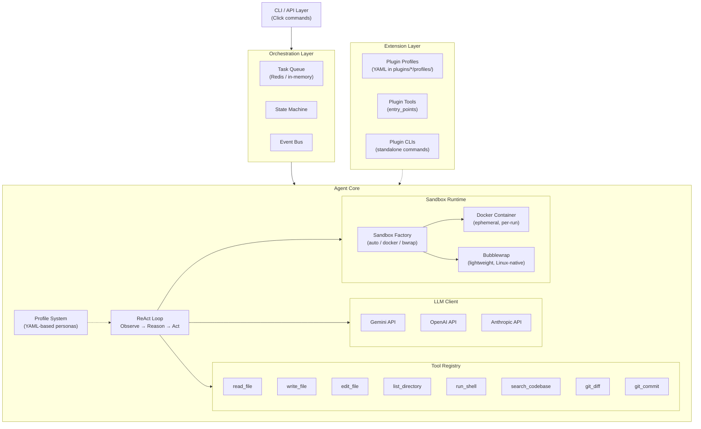
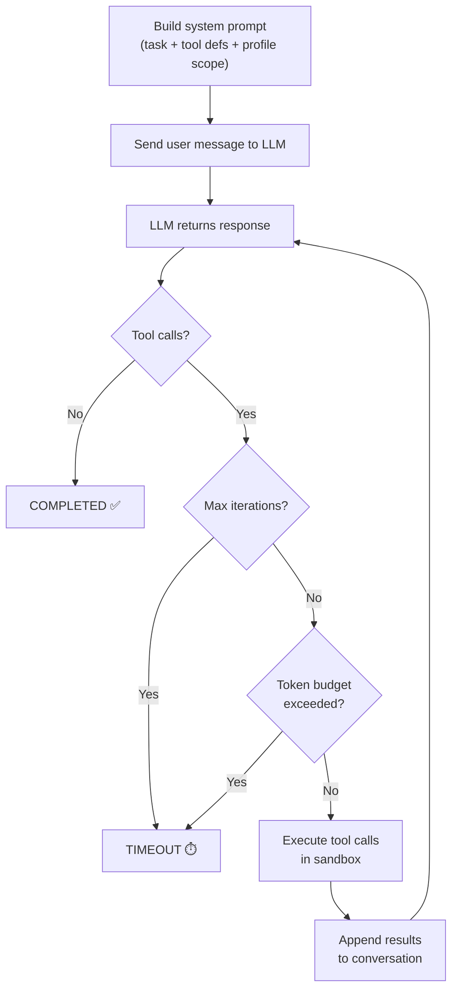
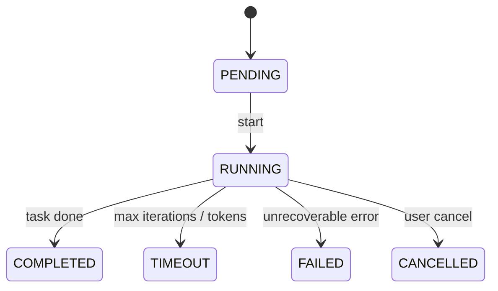

# Architecture

> How Agent Forge is structured — from CLI to sandbox.

## System Overview

Agent Forge implements the **ReAct** (Reasoning + Acting) pattern:



### System Architecture



## Core vs Extension Layer

Agent Forge follows a **domain-agnostic core** design. The core packages
(`agent_forge/*`) provide generic coding-agent capabilities. Any
domain-specific functionality (e.g., smart-contract auditing, security scanning)
lives in the **extension layer** and is never imported by core.

```
┌──────────────────────────────────────────────────────────────┐
│  CORE  (agent_forge/*)                                       │
│  Generic, domain-agnostic capabilities:                      │
│  LLM adapters, ReAct loop, sandbox, tools, profiles,         │
│  orchestration, observability, CLI, hosted service shell      │
├──────────────────────────────────────────────────────────────┤
│  EXTENSION LAYER  (plugins/, skills/, workflows/)            │
│  Domain-specific capabilities loaded at runtime:             │
│  - plugins/proof_of_audit/  → audit profiles, comparison     │
│    engine, challenge evidence CLI                            │
│  - plugins/<other-domain>/  → any future specialization      │
│  - --profiles-dir, entry_points, skill files, workflows      │
└──────────────────────────────────────────────────────────────┘
```

Extensions are discovered at runtime through:

- **Entry points** — Python's standard plugin mechanism (used for tools via
  the `agent_forge.tools` group)
- **`--profiles-dir`** — CLI flag pointing to directories of profile YAMLs
- **Config** — `agent-forge.toml` can declare extension paths

Extensions can be **separate installable packages** — they do not need to live
in this monorepo.

## Layer Responsibilities

### CLI Layer (`agent_forge/cli.py`)

- Click-based commands: `run`, `status`, `list`, `config`, `serve`
- Two execution modes for `run`:
  - **Direct mode** (default) — CLI creates an `EventBus` and calls `react_loop()` directly
  - **Queue mode** (`--queue memory|redis`) — CLI enqueues a `Task`, a `Worker` dequeues and runs it
- Wires configuration, API keys, LLM providers, and sandbox
- Rich terminal output (tables, panels, syntax-highlighted JSON)

### Agent Core (`agent_forge/agent/`)

| Module           | Purpose                                                                             |
| ---------------- | ----------------------------------------------------------------------------------- |
| `core.py`        | ReAct loop — the main Observe → Reason → Act cycle                                  |
| `models.py`      | Data classes: `AgentRun`, `AgentConfig`, `RunState`, `ToolInvocation`               |
| `state.py`       | State machine with valid transitions (PENDING → RUNNING → COMPLETED/FAILED/TIMEOUT) |
| `persistence.py` | Save/load runs to `~/.agent-forge/runs/<id>/` as JSON + JSONL                       |
| `prompts.py`     | System prompt builder with tool descriptions                                        |

### Profile System (`agent_forge/profiles/`)

Configurable agent personas defined as YAML files:

| Module       | Purpose                                                     |
| ------------ | ----------------------------------------------------------- |
| `profile.py` | `AgentProfile` Pydantic model + `load_profiles()` loader    |
| `builtins/`  | Built-in profiles: `gemini.yaml`, `openai.yaml`, `thorough.yaml` |

Each profile configures: `prompt_scope`, `llm_provider`, `llm_model`,
`max_iterations`. Domain-specific profiles (e.g., audit detectors) live in
plugin directories and are loaded via `--profiles-dir` or auto-discovery from
`plugins/*/profiles/`.

### LLM Client Layer (`agent_forge/llm/`)

Unified interface `LLMProvider` with adapters for:

- **Gemini** (primary) — REST API via httpx, retry with exponential backoff
- **OpenAI** — chat completions API
- **Anthropic** — messages API with tool_use blocks

All adapters implement:

```python
class LLMProvider(ABC):
    async def complete(messages, tools, config) -> LLMResponse
    async def stream(messages, tools, config) -> AsyncIterator[LLMResponse]
```

The `factory.py` module provides `create_provider(name, api_key)` for
instantiating adapters by name. New providers are registered in the
`_PROVIDERS` dict.

### Tool System (`agent_forge/tools/`)

Built-in tools, each implementing the `Tool` ABC:

| Tool              | Description                     |
| ----------------- | ------------------------------- |
| `read_file`       | Read file contents from sandbox |
| `write_file`      | Create/overwrite files          |
| `edit_file`       | Surgical line-range edits       |
| `list_directory`  | List files and directories      |
| `run_shell`       | Execute shell commands          |
| `search_codebase` | Grep/ripgrep code search        |
| `git_diff`        | Inspect staged, unstaged, or ref-based diffs |
| `git_commit`      | Commit staged changes           |
| `git_create_branch` | Create and check out a branch |
| `create_pr`       | Open a GitHub pull request      |

Tools are registered in `ToolRegistry` and their schemas are passed to the LLM
as function declarations. External tools can be loaded via **entry points** in
the `agent_forge.tools` group (see [Extending](extending.md)).

### Sandbox Runtime (`agent_forge/sandbox/`)

Agent Forge supports multiple sandbox backends, selected via the `factory.py`
module:

| Backend   | Module     | Description                                               |
| --------- | ---------- | --------------------------------------------------------- |
| `docker`  | `docker.py` | Ephemeral Docker containers — full isolation, cross-platform |
| `bwrap`   | `bwrap.py`  | Linux bubblewrap — lightweight, no daemon, fast startup    |
| `auto`    | `factory.py` | Prefer Docker, fallback to bwrap if Docker unavailable    |

Common properties across backends:

- Workspace is bind-mounted read/write
- Configurable: CPU/memory limits, network access, timeout
- Container/namespace is created per-run and destroyed after
- Validated path security — all operations stay within `/workspace`

### Orchestration (`agent_forge/orchestration/`)

| Module           | Purpose                                                           |
| ---------------- | ----------------------------------------------------------------- |
| `queue.py`       | Task queue ABC + in-memory priority queue implementation          |
| `redis_queue.py` | Redis-backed task queue (requires `redis` extra)                  |
| `worker.py`      | Polls the queue, invokes the task runner, emits lifecycle events  |
| `events.py`      | In-process async pub/sub event bus (run started/completed/failed) |

The CLI wires these together: `CLI → TaskQueue.enqueue() → Worker.dequeue() → react_loop()`.

## Hosted Service Mode

Hosted mode reuses the same queue, worker, sandbox, and persistence layers, but
adds a FastAPI edge for machine clients plus client auth/policy enforcement.

- `agent_forge/service/app.py` exposes the hosted `/v1/runs` contract
- `agent_forge/service/security.py` loads client policy from the hosted client registry
- `agent_forge/service/client.py` provides the Proof-of-Audit compatibility harness

The hosted service auto-discovers plugin profiles from `plugins/*/profiles/`
and merges them with core built-in profiles for the profile registry.

For deployment topology, trust boundaries, and rollout guidance, see the
[Hosted Service Guide](hosted-service.md).

## ReAct Loop Sequence



## State Transitions



For the full technical specification, see [spec.md](spec.md).
