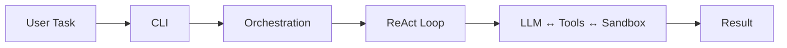
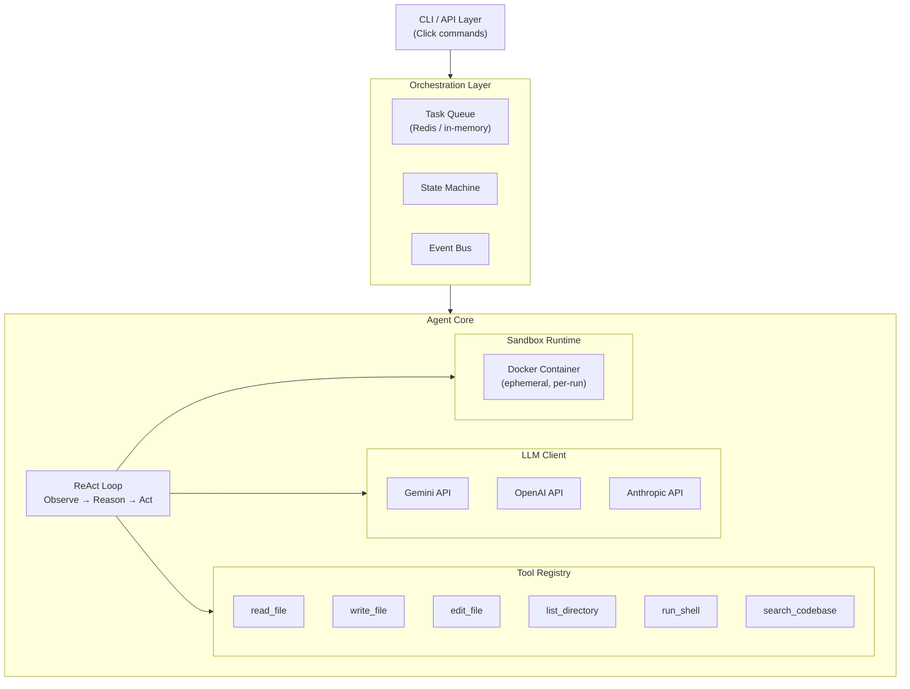
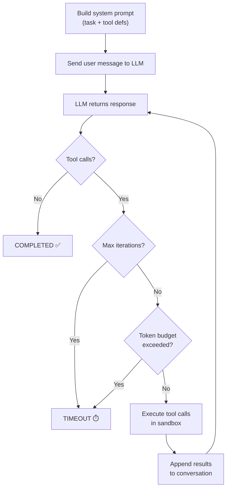
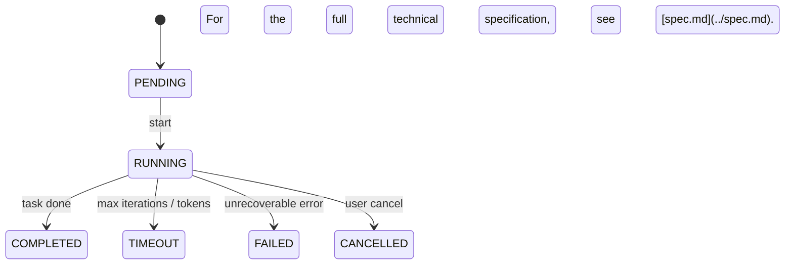

# Architecture

> How Agent Forge is structured — from CLI to sandbox.

## System Overview

Agent Forge implements the **ReAct** (Reasoning + Acting) pattern:



### System Architecture



## Layer Responsibilities

### CLI Layer (`agent_forge/cli.py`)

- Click-based commands: `run`, `status`, `list`, `config`
- Wires configuration, API keys, LLM providers, and sandbox
- Rich terminal output (tables, panels, syntax-highlighted JSON)

### Agent Core (`agent_forge/agent/`)

| Module           | Purpose                                                                             |
| ---------------- | ----------------------------------------------------------------------------------- |
| `core.py`        | ReAct loop — the main Observe → Reason → Act cycle                                  |
| `models.py`      | Data classes: `AgentRun`, `AgentConfig`, `RunState`, `ToolInvocation`               |
| `state.py`       | State machine with valid transitions (PENDING → RUNNING → COMPLETED/FAILED/TIMEOUT) |
| `persistence.py` | Save/load runs to `~/.agent-forge/runs/<id>/` as JSON + JSONL                       |
| `prompts.py`     | System prompt builder with tool descriptions                                        |

### LLM Client Layer (`agent_forge/llm/`)

Unified interface `LLMProvider` with adapters for:

- **Gemini** (primary) — REST API via httpx, retry with exponential backoff
- **OpenAI** — chat completions API
- **Anthropic** — messages API with tool_use blocks

All adapters implement:

```python
class LLMProvider(ABC):
    async def complete(messages, tools, config) -> LLMResponse
    async def stream(messages, tools, config) -> AsyncIterator[LLMResponse]
```

### Tool System (`agent_forge/tools/`)

Six built-in tools, each implementing the `Tool` ABC:

| Tool              | Description                     |
| ----------------- | ------------------------------- |
| `read_file`       | Read file contents from sandbox |
| `write_file`      | Create/overwrite files          |
| `edit_file`       | Surgical line-range edits       |
| `list_directory`  | List files and directories      |
| `run_shell`       | Execute shell commands          |
| `search_codebase` | Grep/ripgrep code search        |

Tools are registered in `ToolRegistry` and their schemas are passed to the LLM as function declarations.

### Sandbox Runtime (`agent_forge/sandbox/`)

- Every tool invocation runs inside an **ephemeral Docker container**
- Workspace is bind-mounted read/write
- Configurable: CPU/memory limits, network access, timeout
- Container is created per-run and destroyed after

### Orchestration (`agent_forge/orchestration/`)

- `queue.py` — Task queue (Redis or in-memory) for concurrent runs
- `events.py` — In-process pub/sub event bus

## ReAct Loop Sequence



## State Transitions


