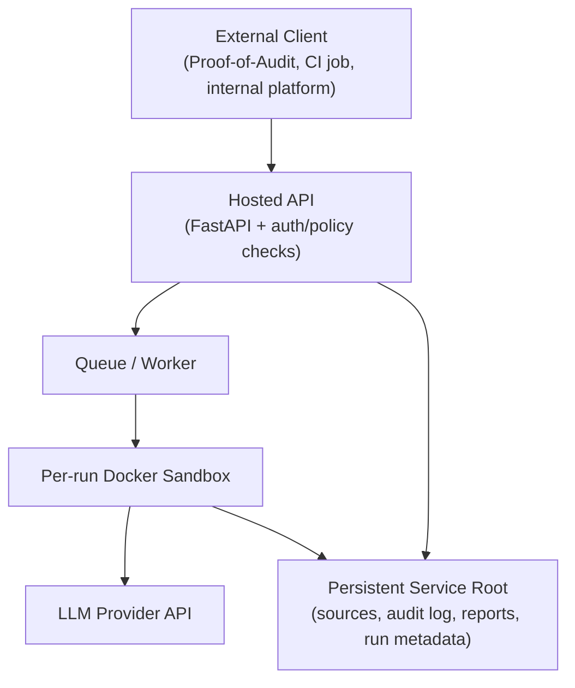

# Hosted Service Guide

> How to run, secure, and operate Agent Forge as a long-running hosted service.

## What Hosted Mode Adds

Hosted mode turns Agent Forge from a local CLI into a continuously running
FastAPI service that accepts versioned job requests from external clients such
as Proof-of-Audit.

Core hosted responsibilities:

- accept `POST /v1/runs` submissions from authenticated clients
- persist machine-readable status and report artifacts for polling clients
- execute each run inside the existing Docker sandbox model
- enforce client-level policy, quota, and audit requirements at the service edge

## Architecture And Trust Boundaries



Trust boundaries to keep explicit:

- Clients are untrusted until authenticated by API key.
- Hosted policy checks must happen before a run is enqueued.
- Sandboxes remain the execution boundary for repository inspection and tool use.
- LLM provider credentials stay in the host environment, never inside client payloads.
- Audit logs and run artifacts must live on persistent storage outside ephemeral workers.

## Deployment Topology

The current hosted deployment model assumes:

- a long-running `agent-forge serve` process
- access to Docker so each run can create its sandbox container
- persistent disk for `service.root_dir` and `~/.agent-forge/runs`
- optional Redis if you move beyond the in-memory queue backend

The repository includes a service-oriented container image and compose service:

- `Dockerfile.service`
- `docker-compose.yml`

The compose topology is intended for local development and small hosted
deployments:

- `agent-forge-service` runs the FastAPI server
- `redis` is available for queue-backed execution if enabled
- a persistent volume stores service data and audit artifacts
- the Docker socket is mounted so the hosted service can start per-run sandboxes

### Multi-Instance Mode

For production deployments, multiple instances can run concurrently behind a
load balancer, each bound to a specific **persona** (agent profile):

```
                    ┌─────────────────┐
                    │   Load Balancer  │
                    └────────┬────────┘
         ┌──────────────┬────┴─────┬──────────────┐
    ┌────┴────┐   ┌─────┴───┐ ┌───┴─────┐  ┌─────┴─────┐
    │ :8001   │   │ :8002   │ │ :8003   │  │ :8004     │
    │ reentry │   │ access  │ │ full    │  │ gemini    │
    └─────────┘   └─────────┘ └─────────┘  └───────────┘
```

```bash
# Instance 1: reentrancy specialist
agent-forge serve --port 8001 --persona reentrancy-only --instance-id agent-01

# Instance 2: access control specialist
agent-forge serve --port 8002 --persona access-control-only --instance-id agent-02

# Instance 3: full spectrum
agent-forge serve --port 8003 --persona full-spectrum --instance-id agent-03
```

Key behavior:

- **`--persona`**: binds the instance to a specific agent profile from the
  profile registry. The persona is validated at startup — unknown profiles
  cause an immediate error. The health endpoint reports the persona's
  capabilities and LLM provider.
- **`--instance-id`**: isolates the workspace under
  `{service.root_dir}/{instance-id}/` so instances sharing a disk never
  collide on source material, audit logs, or run artifacts.
- Both flags are optional. Without them, the service runs in single-instance
  mode exactly as before (backward compatible).

## Hosted Configuration

Hosted mode extends the standard config with a `service` section:

```toml
[service]
host = "127.0.0.1"
port = 8000
root_dir = "~/.agent-forge/service"
healthcheck_path = "/healthz"
auth_enabled = true
api_key_header = "X-Agent-Forge-API-Key"
clients_path = "~/.agent-forge/service/clients.toml"
allow_local_path_sources = false
max_source_size_bytes = 50_000_000
```

Relevant settings:

- `service.root_dir`: hosted data root for extracted sources and audit logs
- `service.healthcheck_path`: readiness endpoint used by load balancers and compose health checks
- `service.auth_enabled`: turns API-key enforcement on for all `/v1/runs` endpoints
- `service.clients_path`: TOML registry describing external clients and their policy limits
- `service.allow_local_path_sources`: global safety switch for colocated `local_path` submissions
- `service.max_source_size_bytes`: upper bound on accepted source material size
- Authentication is enforced before request validation and run lookup on `/v1/runs*`
  so anonymous callers receive `401` instead of schema or existence errors.

### Client Registry

Hosted auth and policy rules are stored separately from repo config in
`service.clients_path`:

```toml
[clients.proof-of-audit-auditor]
api_key_env = "POA_SERVICE_API_KEY"
allowed_profiles = ["proof-of-audit-solidity-v1"]
allowed_report_schemas = ["proof-of-audit-report-v1"]
allowed_source_kinds = ["archive_uri", "local_path"]
max_active_runs = 1
max_runs_per_day = 5
allow_local_path = true
```

This keeps secrets out of source control while still letting the service load
client policy declaratively.

Required secrets stay in environment variables:

```bash
export GEMINI_API_KEY="..."
export POA_SERVICE_API_KEY="..."
```

When a hosted client submits `archive_uri`, the service can materialize local
archives and `gs://` objects. Remote `archive_uri` inputs still need to resolve
to a local file before extraction, so the hosted runtime identity must have
read access to the relevant Cloud Storage bucket or objects.

## Local Development Workflow

### 1. Build Sandbox Support

```bash
make build-sandbox
```

### 2. Prepare Client Policy

Create `~/.agent-forge/service/clients.toml` with at least one client entry, and
export the referenced API key environment variable. Each client entry must
declare `allowed_report_schemas` in addition to `allowed_profiles`, source
policy, and quota settings.

### 3. Start Dependencies

For local queue-backed development:

```bash
docker compose up -d redis
```

The checked-in compose deployment also sets:

```bash
AGENT_FORGE_SERVICE_AUTH_ENABLED=true
AGENT_FORGE_SERVICE_CLIENTS_PATH=/var/lib/agent-forge/service/clients.toml
```

If your deployment does not use `docker compose`, set those environment
variables explicitly or the service will fall back to repo defaults.

### 4. Run The Hosted Service

```bash
# Single-instance mode (default)
agent-forge serve --host 127.0.0.1 --port 8000

# Multi-instance mode with persona binding
agent-forge serve --host 0.0.0.0 --port 8001 \
  --persona reentrancy-only --instance-id agent-01
```

Or use compose:

```bash
docker compose up agent-forge-service
```

### 5. Exercise The API

You can use the compatibility helper in `agent_forge.service.client` or a raw
HTTP request:

```bash
curl -X POST http://127.0.0.1:8000/v1/runs \
  -H "Content-Type: application/json" \
  -H "X-Agent-Forge-API-Key: $POA_SERVICE_API_KEY" \
  -d @request.json
```

## Operations And Debugging

### Health Checks

- `GET /healthz` returns readiness information for the current service process
- compose uses this endpoint for container health

The health response includes multi-instance persona metadata when available:

```json
{
  "status": "ok",
  "service_root": "/var/lib/agent-forge/service/agent-01",
  "queue_backend": "memory",
  "sandbox_image": "agent-forge-sandbox:latest",
  "instance_id": "agent-01",
  "persona": "reentrancy-only",
  "capabilities": ["reentrancy"],
  "llm_provider": "gemini"
}
```

Without `--persona` / `--instance-id`, the extra fields default to `null` / `[]`.

### Artifact Locations

Hosted mode writes useful state to disk:

- `<service.root_dir>/sources/<run_id>/` for extracted source material
- `<service.root_dir>/audit/events.jsonl` for client accept/deny/run lifecycle events
- `~/.agent-forge/runs/<run_id>/` for persisted run metadata, events, and summaries
- `.agent-forge/report.json` inside each workspace for machine-readable downstream output

### Common Failure Modes

- `unauthorized`: missing or invalid hosted API key, or missing provider API key
- `policy_denied`: client requested a disallowed profile, report schema, or source kind
- `quota_exceeded`: active-run or daily-run limit reached
- `source_fetch_failed`: the submitted source URI could not be resolved, downloaded, or extracted
- `sandbox_execution_failed`: run reached the sandbox but failed during execution
- `report_generation_failed`: agent completed (including recovery pass) without ever writing the report file
- `report_invalid_json`: report.json exists but contains malformed JSON
- `report_schema_invalid`: report.json is valid JSON but is missing required schema fields (e.g., `schema_version`, `summary`, `findings`, `stats`)

#### Report Recovery Pass

When the primary agent loop completes without writing `.agent-forge/report.json`,
the hosted service automatically attempts a **single-turn recovery pass** — one
additional LLM call that explicitly instructs the model to write the report
using its existing audit context. This costs one extra LLM round-trip but
avoids failing runs where the model simply forgot to call `write_file`.

After the recovery pass (or if the primary run already wrote the file), the
service validates the report:

1. File must exist → otherwise `report_generation_failed`
2. File must parse as valid JSON → otherwise `report_invalid_json`
3. JSON must contain all required top-level fields → otherwise `report_schema_invalid`

### Rollout Guidance

- Keep hosted auth enabled in any shared environment.
- Start with a single trusted client and tight quotas.
- Validate `main` CI plus service PR CI before promoting a new image.
- Roll out config changes and client-registry changes together so auth and policy stay aligned.
- Monitor `events.jsonl` and run artifacts during rollout; they are the fastest way to confirm the service path is actually being exercised.
  Each event now includes client identity, request origin, request/run identifiers,
  profile id, submit time, lifecycle status, and any rejection or failure reason.
